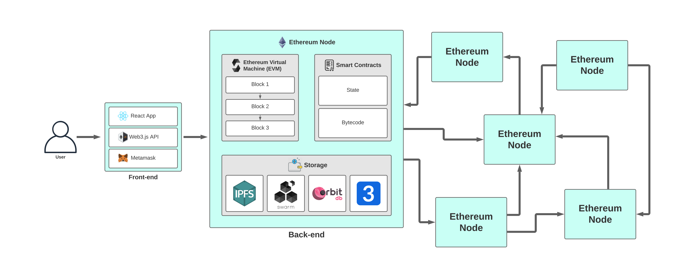

# The Practicality of Decentralized Smart Contracts
IT8010 Capstone Project - Instructed by Dr. Murat Ozer

Stephen Eades - Eadessn@mail.uc.edu

## Synopsis
The growth of blockchain technology has facilitated the discussion of decentralized systems going mainstream. Everyone seems to want to apply blockchain technology to their usecase. Insurance, lending, and even video games and collectibles are being built on top of decentralized systems. One of the most popular and mature decentralized platforms is Ethereum, which allows developers to write determinisitic smart contracts that execute trustlessly by way of the Ethereum Virtual Machine. This project evaluates the use of decentralized computing and smart contracts built on Ethereum. I examine a decentralized application (dapp) and the transaction costs and feasability of utilizing such a dapp for common events such as a poll, escrow service, or lottery. I found that ...state clearly defined findings summary from my data that addresses research questions. Transaction information was pulled from Ganache and Truffle, two tools for working with Ethereum, and analyzed using Pandas and matplotlib within a Jupyter Notebook. Comparisons supported that several factors influence transaction costs, mainly the price flucuation of Ethereum's native token (Ether), and the amount of data being provided as input to the transactions. This additionally provided insight on the challenges and limitations of current decentralized applications, such that the benefits may not yet outweigh the costs, and may not until proper scaling is implemented on Ethereum. 

## Research Questions
* What are the associated transaction costs of interacting with a decentralized application on Ethereum?
* What factors influence the transaction costs on a decentralized application?
* Can a decentralized application effectively handle everyday events that require trust?

## Problem Statement
Blockchain technology has shown that the removal of trust in a system is possible, and many are wondering how this new technology will fit into a world where trust seems more important that ever. Smart contracts and decentralized applications on the Ethereum Blockchain have been a major point of focus in the newfound industry, and developers have begun to explore what this technology is capable of. However, there has yet to be major usage of decentralized applications by the general population. One concern is that the current costs associated with making transactions on a blockchain can be exorbantly high, as scaling and protocol solutions are still being implemented. These high costs likely drive potential users away from decentralized systems. Another issue is that a majority of current dapps are for financial services that a regular person wouldn't often use. Decentralized exchanges (DEXs) and decentralized lending and money markets, also known as Decentralized Finance (Defi), dominate the current dapp ecosystem. Most users of these dapps are wealthy indivudals and institutional investors looking for liquidity, arbitrage, and investment opportunities. 

Blockchain technology could help remove the middleman, and trust, from many situations where it would benefit the end users. Imagine a smart contract that automatically calculates and allocates your retirement funds for you based on your risk assessment, market conditions, and preferences, ultimately removing the need for a financial advisor. A decentralized version of many current platforms (Facebook, Uber, etc.) would remove the need for centralized servers and storing user data, which means companies would have an easier time with regulations like GDPR. Elections could be held entirely on a blockchain, allowing any user to check and validate any other vote that occurred, ensuring a election process that can't be tampered with or manipulated. These ideas all sound wonderful on paper, but how effective and practical they are for the user is yet to be determined. With the afforementioned concerns stated above, one might assume that these kind of decentralized applications and products are still years out from being ready for everyday usage by the general population. 

The dapp that I developed provides the user the ability to create and deploy their own smart contract event. The user simply inputs the event details, and the deployment process implements their details into the event logic. Similiar studies tended to evaluate a specific transaction and how it varied with time and the price of Ether, while my application will additionally explore and compare multiple transaction types (transfering Ether, deploying contracts, writing to contract storage, etc.) and how the user's input for the creation of each contract impacts the cost. I also believe the ability to let the user customize their own smart contract could be a way to help grow the adoption of decentralized applications for day-to-day usage. I hope my project can give future users, researchers, and developers awareness on the benefits and downsides of using and building a decentralized application. If successful, blockchain technology and decentralization could revolutionize how we exchange value and automate processes that require trust.

## Architecture & Engineering
When considering the architecture of this project, I first needed to choose the blockchain that I would build my application on. Out of the contenders, Ethereum was the most mature in both age and ecosystem. Ethereum came out in 2015, and many developers have created tutorials, written books, built tools and created applications that helped me come to the decision of building on Ethereum. Solidity is the language used for the Ethereum Virtual Machine (EVM) and will be what I write my smart contracts in. Truffle will be an important tool, as it helps with building, deploying, and testing the application. Another importance piece is having a testnet blockchain to work on before deploying to production. Ganache will come into play there, and provides us some accounts with fake ethereum to cover our transaction costs. The final part will be creating a frontend interface for users to interact with our smart contracts. Truffle happens to have some frameworks, such as Drizzle, that already has React components for the UI. This does a lot of the work for me on the frontend so I can focus on the smart contracts. Finally, Web3.js api will be used to connect the frontend with the Ethereum network, and will help us check if the user has the Metamask wallet extension. Without Metamask, the user won't be able to use their Ethereum to interact with the smart contracts. 

All-in-all, the tools, frameworks, and technologies I'm using are below with their versions. 
* Solidity - 0.5.16
* Web3.js - 1.2.9
* Truffle - 5.2.2
* Drizzle - 1.0.0
* Ganache - 2.5.4
* Metamask - 9.3.0
* Node - 10.19.0
* npm - 6.14.4

To help illustrate, I drew up the achitecture to provide a standard view of a decentralized application. You can see the user interacts with the React frontend and encounters the Web3.js api and check for Metamask. They then are able to interact with the Ethereum network which consists of many nodes, all containing smart contracts, storage options, and the EVM for processing. 

This dapp structure begins with the frontend, which handles receiving the user input and sending to the backend i.e. smart contract. This occurs through the web.js api, with the help of Drizzle which uses React's context and state management to keep the frontend synced with the smart contracts data that it connects to. On the receiving end of the frontend's requests is the main `EventManager.sol` contract. This can be thought of as the parent that manages the child contracts, and exposes getter functions so the frontend can access data on any existing contracts that have been deployed. This contract can create new contracts by sending a request to the `EventCreator.sol` which has the sole job of creating and deploying event contracts for the EventManager contract to manage. The three smart contract event types are `PollEvent.sol`, `EscrowEvent.sol`, and `LotteryEvent.sol`. They each utilize a constructor that handles the initial configuration of the events logic. For exampe, candidate names for polls, involved parties for escrows, and ticket price for lotteries are all mapped to the contract's storage during this constructor process. At this point, the event contract has been configured and contains all the functions and logic needed to process that type of event. Below we will look at the struct of each contract event to better understand their makeup:

Poll Candidate | Escrow Member | Lottery Ticket
------------ | ------------- | -------------
/**                       |              /**                                                          
Model for each candidate  |              Model for each member                          
*/                        |              */            
struct Candidate {        |              struct Member {                                  
    uint id;              |                  uint id;                    
    string name;          |                  address memberAddress;                    
    uint voteCount;       |                  uint currentDeposit; 
                          |                   uint requiredDeposit;
}                         |              }    

    /**                                      /**                                                          
    Model for each candidate                 Model for each member                          
    */                                       */            
    struct Candidate {                       struct Member {                                  
        uint id;                                 uint id;                    
        string name;                             address memberAddress;                    
        uint voteCount;                          uint currentDeposit;            
    }                                        }      

I'll be adding more here to expand on the data models and file structure of application. Considerations made when designing architecture of app. The code logic I used for each contract creation process, variable definitions, etc. Lorem ipsum dolor sit amet, consectetur adipiscing elit. Phasellus sed mauris molestie, elementum tortor id, bibendum neque. Sed pretium sed eros in pellentesque. Curabitur gravida, risus nec interdum dictum, sapien velit volutpat arcu, sit amet iaculis erat justo non arcu. Maecenas egestas enim ex, id suscipit lorem pharetra a. Vivamus aliquam augue dui, ullamcorper semper nisl feugiat et. Quisque blandit nunc eget augue vestibulum bibendum. Praesent nisi arcu, suscipit vitae sapien pharetra, lobortis laoreet libero. Nunc placerat sapien nisl, iaculis blandit sapien tempor vitae. Donec euismod risus odio, ac maximus dolor sollicitudin id. Orci varius natoque penatibus et magnis dis parturient montes, nascetur ridiculus mus. Proin ac bibendum ante. Proin sollicitudin ex sit amet purus pretium, ultrices luctus nisi tincidunt. Nulla in efficitur enim.e.Orci varius natoque penatibus et magnis dis parturient montes, nascetur ridiculus mus. Proin ac bibendum ante. Proin sollicitudin ex sit amet purus pretium, ultrices luctus nisi tincidunt. Nulla in efficitur enime.

I'll be adding more here about the specific solidity features and some issues I had to figure out when coding. concerns that arose when building my app, such as not being able to easily get randomization, or not having "time" and having to use the block timestamp. Using Kekkac to get random number. Lorem ipsum dolor sit amet, consectetur adipiscing elit. Phasellus sed mauris molestie, elementum tortor id, bibendum neque. Sed pretium sed eros in pellentesque. Lorem ipsum dolor sit amet, consectetur adipiscing elit. Phasellus sed mauris molestie, elementum tortor id, bibendum neque. Sed pretium sed eros in pellentesque..

## User Experience & Interface
I'll be adding here once the application is completed and I can have users test. Go over MetaMask and what users must first do. Talk about the user flow and their experience through out it. How Drizzle helped with this, where it fell short. Best practices that I tried to implement or that I think should be implemented for all dapps. Lorem ipsum dolor sit amet, consectetur adipiscing elit. Phasellus sed mauris molestie, elementum tortor id, bibendum neque. Sed pretium sed eros in pellentesque. Lorem ipsum dolor sit amet, consectetur adipiscing elit. Phasellus sed mauris molestie, elementum tortor id, bibendum neque. Sed pretium sed eros in pellentesque. The below image is of the applications early interface mockup:

### Experience with Event Contracts:
* Poll Event Contract: Talk about the logic of this contract and how effective it was in its user experience, interface, and ability to complete the event accurately and without error. Lorem ipsum dolor sit amet, consectetur adipiscing elit. Phasellus sed mauris molestie, elementum tortor id, bibendum neque. Sed pretium sed eros in pellentesque.

* Escrow Event Contract: Talk about the logic of this contract and how effective it was in its user experience, interface, and ability to complete the event accurately and without error. Lorem ipsum dolor sit amet, consectetur adipiscing elit. Phasellus sed mauris molestie, elementum tortor id, bibendum neque. Sed pretium sed eros in pellentesque.

* Lottery Event Contract: Talk about the logic of this contract and how effective it was in its user experience, interface, and ability to complete the event accurately and without error. Lorem ipsum dolor sit amet, consectetur adipiscing elit. Phasellus sed mauris molestie, elementum tortor id, bibendum neque. Sed pretium sed eros in pellentesque.

I'll be writing here about the challenges users might face. Interface issues I had, syncing with the blockchain to render the new data. Can include suggestions for future use, ways to make dapp more practical and things like that regarding UI/UX.... Lorem ipsum dolor sit amet, consectetur adipiscing elit. Phasellus sed mauris molestie, elementum tortor id, bibendum neque. Sed pretium sed eros in pellentesque. Curabitur gravida, risus nec interdum dictum, sapien velit volutpat arcu, sit amet iaculis erat justo non arcu. Maecenas egestas enim ex, id suscipit lorem pharetra a. Vivamus aliquam augue dui, ullamcorper semper nisl feugiat et. Quisque blandit nunc eget augue vestibulum bibendum. Praesent nisi arcu, suscipit vitae sapien pharetra, lobortis laoreet libero. Nunc placerat sapien nisl, iaculis blandit sapien tempor vitae. Donec euismod risus odio, ac maximus dolor sollicitudin id. Orci varius natoque penatibus et magnis dis parturient montes, nascetur ridiculus mus. Proin ac bibendum ante. Proin sollicitudin ex sit amet purus pretium, ultrices luctus nisi tincidunt. Nulla in efficitur enim.

Praesent nisi arcu, suscipit vitae sapien pharetra, lobortis laoreet libero. Nunc placerat sapien nisl, iaculis blandit sapien tempor vitae. Donec euismod risus odio, ac maximus dolor sollicitudin id. Orci varius natoque penatibus et magnis dis parturient montes, nascetur ridiculus mus. Proin ac bibendum ante. Proin sollicitudin ex sit amet purus pretium, ultrices luctus nisi tincidunt. Nulla in efficitur enim.

## Evaluation Metric
Basic overview of miners and gas fees and how they work. Discuss terminology for Ethereum gas and fess, common knowledge that reader should know before going into evaluation of tx data. Brief history of Ethereum price, how its changes and how gas fees/costs have changed over past few years. Explain that this has a huge impact on the current gas prices. Lorem ipsum dolor sit amet, consectetur adipiscing elit. Phasellus sed mauris molestie, elementum tortor id, bibendum neque. Sed pretium sed eros in pellentesque. Curabitur gravida, risus nec interdum dictum, sapien velit volutpat arcu, sit amet iaculis erat justo non arcu. Maecenas egestas enim ex, id suscipit lorem pharetra a.

## Data Insights
Will be compiling data and using Python to create some visualizations of the costs of transactions and creating smart contracts to display. Lorem ipsum dolor sit amet, consectetur adipiscing elit. Phasellus sed mauris molestie, elementum tortor id, bibendum neque. Sed pretium sed eros in pellentesque. Curabitur gravida, risus nec interdum dictum, sapien velit volutpat arcu, sit amet iaculis erat justo non arcu. Maecenas egestas enim ex, id suscipit lorem pharetra a. Vivamus aliquam augue dui, ullamcorper semper nisl feugiat et. Quisque blandit nunc eget augue vestibulum bibendum. Praesent nisi arcu, suscipit vitae sapien pharetra, lobortis laoreet libero. Nunc placerat sapien nisl, iaculis blandit sapien tempor vitae. Donec euismod risus odio, ac maximus dolor sollicitudin id. Orci varius natoque penatibus et magnis dis parturient montes, nascetur ridiculus mus. Proin ac bibendum ante. Proin sollicitudin ex sit amet purus pretium, ultrices luctus nisi tincidunt. Nulla in efficitur enim.e.

Lorem ipsum dolor sit amet, consectetur adipiscing elit. Phasellus sed mauris molestie, elementum tortor id, bibendum neque. Sed pretium sed eros in pellentesque. Lorem ipsum dolor sit amet, consectetur adipiscing elit. Phasellus sed mauris molestie, elementum tortor id, bibendum neque. Sed pretium sed eros in pellentesque..

Lorem ipsum dolor sit amet, consectetur adipiscing elit. Phasellus sed mauris molestie, elementum tortor id, bibendum neque. Sed pretium sed eros in pellentesque. Curabitur gravida, risus nec interdum dictum, sapien velit volutpat arcu, sit amet iaculis erat justo non arcu. Maecenas egestas enim ex, id suscipit lorem pharetra a. Vivamus aliquam augue dui, ullamcorper semper nisl feugiat et. Quisque blandit nunc eget augue vestibulum bibendum. Praesent nisi arcu, suscipit vitae sapien pharetra, lobortis laoreet libero. Nunc placerat sapien nisl, iaculis blandit sapien tempor vitae. Donec euismod risus odio, ac maximus dolor sollicitudin id. Orci varius natoque penatibus et magnis dis parturient montes, nascetur ridiculus mus. Proin ac bibendum ante. Proin sollicitudin ex sit amet purus pretium, ultrices luctus nisi tincidunt. Nulla in efficitur enim.

## Analysis 
Will discuss my analsis of the above data insights and other findings I come across. Lorem ipsum dolor sit amet, consectetur adipiscing elit. Phasellus sed mauris molestie, elementum tortor id, bibendum neque. Sed pretium sed eros in pellentesque. Curabitur gravida, risus nec interdum dictum, sapien velit volutpat arcu, sit amet iaculis erat justo non arcu. Maecenas egestas enim ex, id suscipit lorem pharetra a. Vivamus aliquam augue dui, ullamcorper semper nisl feugiat et. Quisque blandit nunc eget augue vestibulum bibendum. Praesent nisi arcu, suscipit vitae sapien pharetra, lobortis laoreet libero.

## Conclusion
Lorem ipsum dolor sit amet, consectetur adipiscing elit. Phasellus sed mauris molestie, elementum tortor id, bibendum neque. Sed pretium sed eros in pellentesque. Curabitur gravida, risus nec interdum dictum, sapien velit volutpat arcu, sit amet iaculis erat justo non arcu. Maecenas egestas enim ex, id suscipit lorem pharetra a. Vivamus aliquam augue dui, ullamcorper semper nisl feugiat et. Quisque blandit nunc eget augue vestibulum bibendum. Praesent nisi arcu, suscipit vitae sapien pharetra, lobortis laoreet libero. Nunc placerat sapien nisl, iaculis blandit sapien tempor vitae. Donec euismod risus odio, ac maximus dolor sollicitudin id. Orci varius natoque penatibus et magnis dis parturient montes, nascetur ridiculus mus. Proin ac bibendum ante. Proin sollicitudin ex sit amet purus pretium, ultrices luctus nisi tincidunt. Nulla in efficitur enim.
